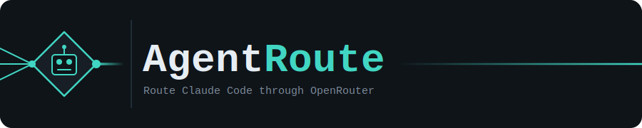

<div align="center">



[](https://github.com/Radixen-Dev/AgentRoute/actions/workflows/ci.yml)
[](https://github.com/Radixen-Dev/AgentRoute/releases)
[](LICENSE)
[](https://goreportcard.com/report/github.com/Radixen-Dev/AgentRoute)

</div>

---

AgentRoute is a single, cross‑platform Go binary that lets [Claude Code](https://claude.com/claude-code)
make its model calls through **[OpenRouter](https://openrouter.ai)** instead of Anthropic's API directly —
so you pay for one OpenRouter key and pick whichever model handles each Opus/Sonnet/Haiku tier, while Claude
Code itself doesn't change at all. It runs a small local gateway, manages the wiring for you, and gives you
either a TUI or a fully scriptable CLI to drive it.

> Codex and Gemini CLI support is designed (see [`internal/platform`](internal/platform) and
> [`manifests/`](manifests)) but not enabled yet — v1 ships Claude Code only. See
> [docs/plugins.md](docs/plugins.md).

<!--
  docs/demo/*.gif are rendered from tapes/*.tape via `make demo` (VHS required).
  See CONTRIBUTING.md § "Updating the demo GIFs" if you need to regenerate them.
-->


## Why

Claude Code talks the Anthropic Messages API. OpenRouter gives you one API key and a marketplace of
models from every provider. AgentRoute is the bridge: a local gateway that Claude Code is pointed at via
its own (official, documented) environment-variable hooks — no monkey-patched config files, no rewriting
`CLAUDE.md`, nothing that breaks when Claude Code updates.

- **One key, any model.** Set your `OPENROUTER_API_KEY` once, then assign any OpenRouter model to Claude
  Code's heavy/balanced/fast tiers.
- **Reversible.** `agentroute up` backs up what it touches; `agentroute down` (or Ctrl+C) restores it
  exactly. Nothing is left dangling in `~/.claude/settings.json`.
- **Two front ends, one engine.** A TUI for interactive use and a `--json`/exit-code scriptable CLI
  for everything else — including for other agents driving AgentRoute itself.
- **Built to extend.** The gateway, translator, and platform-adapter boundaries are designed so adding
  Codex, Gemini CLI, or a new upstream provider doesn't mean rewriting the core.

## Quickstart

```sh
# 1. Install (see "Installation" below for your platform)

# 2. Set your OpenRouter key (stored in your OS keyring)
agentroute key set --value sk-or-v1-...

# 3. Create a profile mapping each tier to an OpenRouter model
agentroute profiles create default \
  --heavy openrouter/anthropic/claude-opus-4.5 \
  --balanced openrouter/anthropic/claude-sonnet-4.6 \
  --fast openrouter/anthropic/claude-haiku-4.5
agentroute profiles activate default

# 4. Start the gateway (foreground; Ctrl+C to stop and unwind cleanly)
agentroute up
```

With `agentroute up` running in one terminal, use `claude` as normal in another — its requests are now
served by the models you picked. Run bare `agentroute` (no arguments) in an interactive terminal to get the
TUI instead, which wraps the same `up`/`down`/profile/model-picker flow in a Dashboard.

See [docs/getting-started.md](docs/getting-started.md) for the full walkthrough, including what
`agentroute doctor` checks before you start. Two more demo clips: the
[plain CLI](docs/demo/up.gif) (`doctor`/`profiles`/`up --help` under `AGENTROUTE_PLAIN=1`) and the
[Model Picker](docs/demo/model-picker.gif) screen.

## Installation

Prebuilt binaries for Windows, macOS, and Linux (amd64/arm64) are published on the
[Releases page](https://github.com/Radixen-Dev/AgentRoute/releases).

```sh
# Homebrew (macOS/Linux)
brew install --cask Radixen-Dev/agentroute/agentroute

# Scoop (Windows)
scoop bucket add agentroute https://github.com/Radixen-Dev/scoop-agentroute
scoop install agentroute
```

Or build from source:

```sh
git clone https://github.com/Radixen-Dev/AgentRoute.git
cd AgentRoute
go build -o bin/agentroute ./cmd/agentroute
```

AgentRoute also needs [LiteLLM](https://github.com/BerriAI/litellm) on `PATH` in v1 — `agentroute doctor`
tells you if it's missing (`pipx install litellm`). This is the one Python dependency of the v1 hybrid
architecture (see [docs/concepts.md](docs/concepts.md)); v2 replaces it with a native Go translator.

## How it works

```
 Claude Code  ──Anthropic /v1/messages──▶  AgentRoute gateway  ──proxy──▶  LiteLLM sidecar  ──▶  OpenRouter
(~/.claude/settings.json                  (127.0.0.1:4505,                (renders config from
 "env" block points here)                  authenticates, applies          your active profile)
                                            your tier→model mapping)
```

- **Gateway** — a local HTTP server that authenticates each request, rewrites the requested model alias
  (`agentroute-heavy`/`-balanced`/`-fast`) to the OpenRouter model your active profile assigns it, and logs
  every request for the TUI's live view.
- **Sidecar** — a managed LiteLLM process that does the actual Anthropic↔OpenRouter request translation in
  v1; AgentRoute starts it, health-checks it, and restarts it if it crashes.
- **Platform adapter** — the thing that points a tool (Claude Code in v1) at the gateway, and un-points it
  cleanly. See [docs/plugins.md](docs/plugins.md).

Full architecture, the `Translator`/`ModelRouter` interfaces, and the v2 roadmap (native Anthropic
translation, Codex/Gemini, multi-provider upstreams) are in [docs/concepts.md](docs/concepts.md).

## CLI

Every interactive flow has a non-interactive equivalent. `agentroute` (no args, interactive TTY) launches
the TUI; every subcommand below works the same with or without it, and supports `--json` for
machine-readable output. Full reference, including stable exit codes, in [docs/cli.md](docs/cli.md).

| Command | What it does |
|---|---|
| `agentroute up` | Start the gateway + sidecar in the foreground, linking Claude Code |
| `agentroute down` | Recover from an unclean shutdown: unlink + clear stale state |
| `agentroute status` | Is the gateway up, on which port, with which profile |
| `agentroute profiles` | List / create / delete / activate per-tier model profiles |
| `agentroute models` | List the OpenRouter model catalog |
| `agentroute key` | Set / clear / check the stored OpenRouter API key |
| `agentroute link` / `unlink` | Point (or un-point) a platform at a running gateway |
| `agentroute doctor` | Check the local environment for everything `up` needs |
| `agentroute tui` | Force the TUI regardless of TTY detection |

## Documentation

- [Getting started](docs/getting-started.md)
- [Concepts](docs/concepts.md) — gateway, translators, tiers, profiles
- [CLI reference](docs/cli.md) — every command, flag, and exit code
- [Platforms & plugins](docs/plugins.md) — how Claude Code is wired, the manifest schema, the v2 plugin plan
- [Branding](docs/branding.md) / [BRANDING.md](BRANDING.md)
- [Troubleshooting](docs/troubleshooting.md)

## Contributing

See [CONTRIBUTING.md](CONTRIBUTING.md) for the fork → branch → PR workflow (every PR needs review from a
[CODEOWNER](.github/CODEOWNERS)), local dev commands, and how to add a new platform. Agents working in
this repo should also read [AGENTS.md](AGENTS.md) first.

## License

[GPL-3.0-only](LICENSE).
