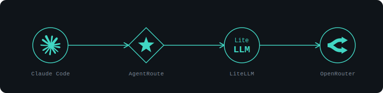

<div align="center">


[](https://github.com/Radixen-Dev/AgentRoute/actions/workflows/ci.yml)
[](https://github.com/Radixen-Dev/AgentRoute/releases)
[](LICENSE)
[](https://goreportcard.com/report/github.com/Radixen-Dev/AgentRoute)

</div>

---

AgentRoute is a single, cross‑platform Go binary that routes [Claude Code](https://claude.com/claude-code) model calls through **[OpenRouter](https://openrouter.ai)** instead of Anthropic's API — one key, any model, no changes to Claude Code itself.

> Codex and Gemini CLI support is designed but not enabled yet — v1 ships Claude Code only. See [docs/plugins.md](docs/plugins.md).

<!--
  docs/demo/*.gif are rendered from tapes/*.tape via `make demo` (VHS required).
  See CONTRIBUTING.md § "Updating the demo GIFs" if you need to regenerate them.
-->


## Why

- **One key, any model.** Set `OPENROUTER_API_KEY` once, assign any OpenRouter model to Claude Code's heavy/balanced/fast tiers.
- **Reversible.** `agentroute up` backs up what it touches; `agentroute down` (or Ctrl+C) restores it exactly — nothing left dangling in `~/.claude/settings.json`.
- **Two front ends.** TUI for interactive use; `--json`/exit-code CLI for scripting and agent-driven workflows.
- **Built to extend.** Gateway, translator, and platform-adapter boundaries let you add Codex, Gemini CLI, or a new upstream without touching the core.

## Quickstart

```sh
# 1. Install (see Installation below)

# 2. Set your OpenRouter key
agentroute key set --value sk-or-v1-...

# 3. Create a profile mapping each tier to an OpenRouter model
agentroute profiles create default \
  --heavy openrouter/anthropic/claude-opus-4.5 \
  --balanced openrouter/anthropic/claude-sonnet-4.6 \
  --fast openrouter/anthropic/claude-haiku-4.5
agentroute profiles activate default

# 4. Start the gateway
agentroute up
```

Use `claude` as normal in another terminal — requests are now served by the models you picked. Run bare `agentroute` for the TUI. Full walkthrough: [getting-started.md](docs/getting-started.md) · [plain CLI demo](docs/demo/up.gif) · [Model Picker](docs/demo/model-picker.gif).

## Installation

```sh
# Homebrew (macOS/Linux)
brew install --cask Radixen-Dev/agentroute/agentroute

# Scoop (Windows)
scoop bucket add agentroute https://github.com/Radixen-Dev/scoop-agentroute
scoop install agentroute
```

Build from source: `git clone … && go build -o bin/agentroute ./cmd/agentroute`

> v1 also needs [LiteLLM](https://github.com/BerriAI/litellm) on `PATH` (`pipx install litellm`). Run `agentroute doctor` to verify your environment.

## How it works



- **Gateway** — authenticates requests, rewrites model aliases (`agentroute-heavy`/`-balanced`/`-fast`) to the OpenRouter model your active profile maps them to, and logs every request for the live view.
- **Sidecar** — the managed LiteLLM process that translates Anthropic↔OpenRouter wire formats; AgentRoute owns its lifecycle.
- **Platform adapter** — points Claude Code at the gateway on `up`, restores its config cleanly on `down`. See [docs/plugins.md](docs/plugins.md).

Full architecture, interfaces, and v2 roadmap in [docs/concepts.md](docs/concepts.md).

## CLI

`agentroute` (no args) launches the TUI; every subcommand works with or without it and supports `--json`. Full reference in [docs/cli.md](docs/cli.md).

| Command | What it does |
|---|---|
| `agentroute up` | Start the gateway + sidecar, linking Claude Code |
| `agentroute down` | Recover from an unclean shutdown: unlink + clear stale state |
| `agentroute status` | Gateway status, port, and active profile |
| `agentroute profiles` | List / create / delete / activate profiles |
| `agentroute models` | Browse the OpenRouter model catalog |
| `agentroute key` | Set / clear / check the OpenRouter API key |
| `agentroute link` / `unlink` | Point or un-point a platform at a running gateway |
| `agentroute doctor` | Check the environment before `up` |
| `agentroute tui` | Force the TUI regardless of TTY detection |

## Documentation

- [Getting started](docs/getting-started.md)
- [Concepts](docs/concepts.md) — gateway, translators, tiers, profiles
- [CLI reference](docs/cli.md) — every command, flag, and exit code
- [Platforms & plugins](docs/plugins.md) — adapters, manifests, v2 plugin plan
- [Branding](BRANDING.md)
- [Troubleshooting](docs/troubleshooting.md)

## Contributing

See [CONTRIBUTING.md](CONTRIBUTING.md) for the branch → PR workflow and [AGENTS.md](AGENTS.md) if you're working here as an agent.

## License

[GPL-3.0-only](LICENSE).
